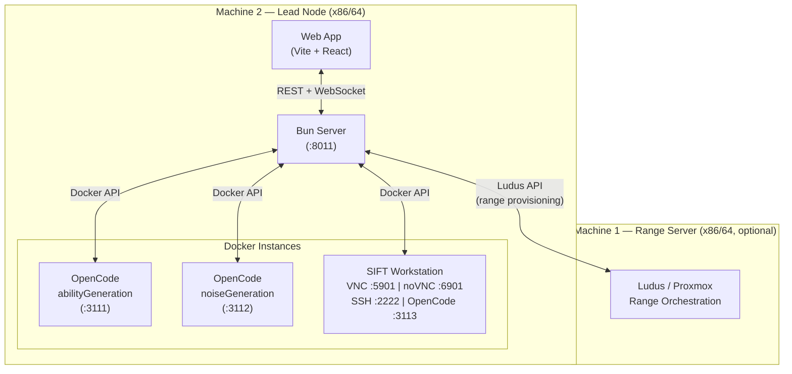
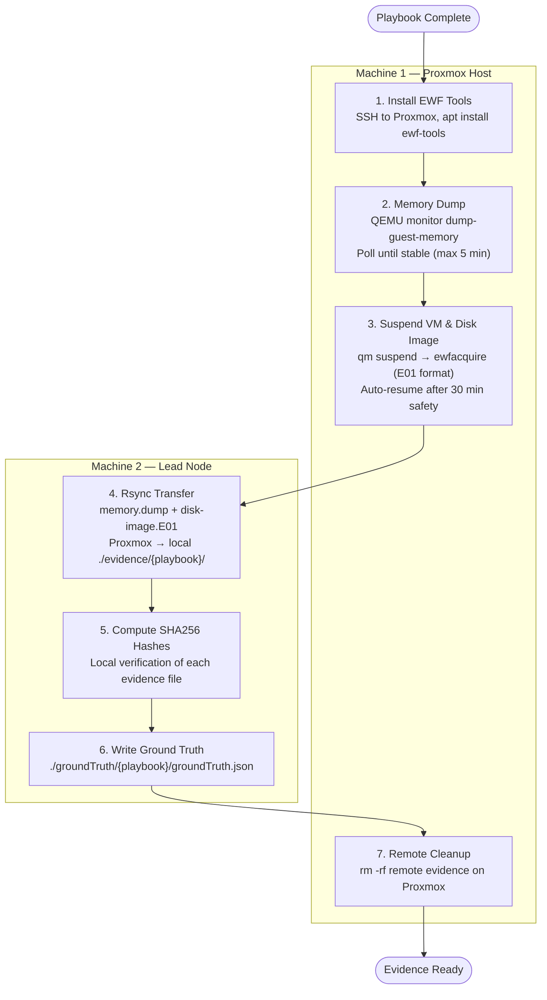
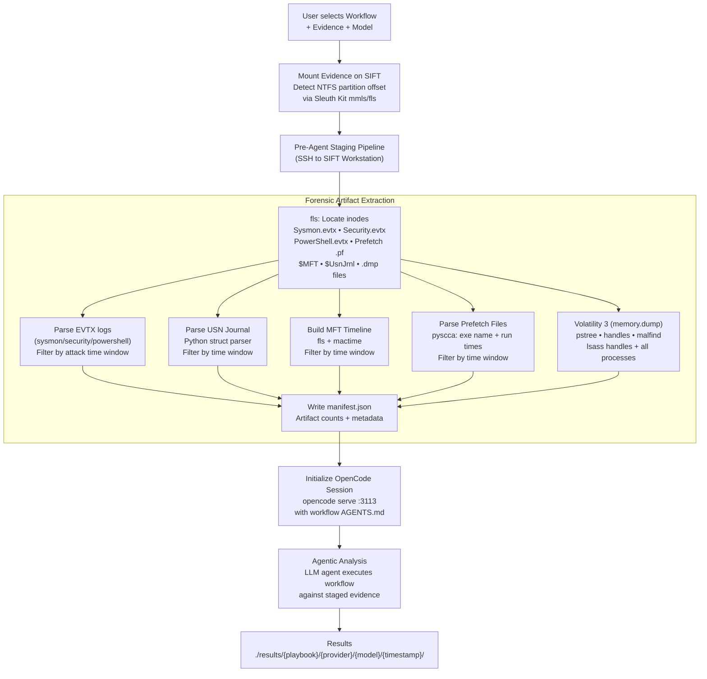
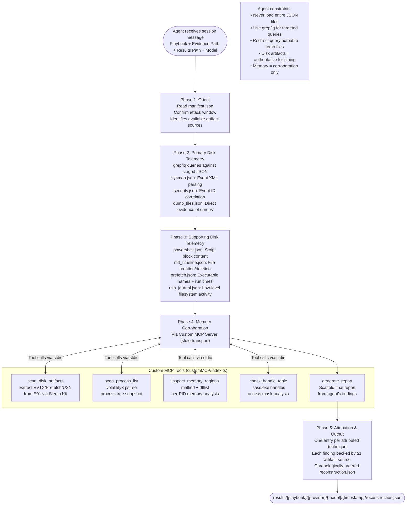

## Code Repository

https://github.com/hiCozyty/SIFTArena

## License

This project is licensed under the MIT License — see the [LICENSE](LICENSE) file for details.

## ATTENTION
My dev post account got suspended for who knows what reason after I submitted my project on time. I can't even find the link. 


## Demonstration Video

https://github.com/user-attachments/assets/168b5530-3b0d-40f8-9a28-8d06a3eedb9c

## Alternative Demo Video

https://vimeo.com/1201633842

## Features & Functionality

**Bring Your Own**
- **Attack Chain** — define custom adversary emulation plans with granular TTP sequencing
- **Workflow** — supply your own forensic analysis pipeline for evaluating agent performance
- **Models** — plug in any LLM (OpenCode, Claude, GPT, etc.) for agentic analysis

**Attack Chain Engine**
- Highly configurable attack chain with reliable ground truth
- Each run produces deterministic artifacts tied to known TTPs for reproducible benchmarking

**Playbooks**
- Importable / exportable playbooks designed for reproducibility
- Share, version, and reuse attack-and-analysis configurations across teams

**Workflow Benchmarking**
- Configurable workflows for benchmarking effectiveness in reconstructing timelines of events from artifacts
- Measure agent accuracy against ground truth across different models and attack scenarios


## Setup Instructions

See [Getting Started](#getting-started) below.

## Live Deployment / Step-by-Step Instructions

See [Getting Started](#getting-started) below.

## Architecture Diagram



The lead node runs the Bun API server, web app, and three Docker instances (OpenCode for ability/noise generation, and a SIFT workstation for forensic analysis). An optional second machine hosts the Ludus/Proxmox range for live attack chain execution and VM orchestration.

### Evidence Collection Pipeline

After a playbook executes the attack chain on the range, evidence is collected through the following pipeline:



The pipeline captures a full forensic snapshot (memory + E01 disk image) of the target VM after the attack chain completes, transfers it to the lead node, verifies integrity with SHA256, records ground truth from the playbook result, and cleans up remote artifacts.

### Agent Workflow (Pre-Agent Handoff Pipeline)

Before handing control to the LLM agent, evidence is staged into structured forensic artifacts accessible to the analysis workflow:



The pre-agent handoff pipeline extracts and normalizes all forensic artifacts on the SIFT workstation before the LLM agent begins analysis. This ensures the agent operates on structured, time-filtered data rather than raw disk images. After staging, an OpenCode session is launched scoped to the selected workflow, and the agent runs the forensic analysis pipeline defined in the workflow's `AGENTS.md`.

### Agent Execution Flow (MCP + Five-Phase Workflow)

The workflow provides a custom MCP server that exposes forensic tools to the LLM agent, orchestrating a five-phase reconstruction pipeline:



The custom MCP server runs as a subprocess under the OpenCode session, communicating via stdio. It provides direct access to Sleuth Kit (icat, fls, mmls) for E01 disk image forensics and Volatility 3 plugins for memory analysis. The agent follows a strict five-phase progression — Orient → Primary → Supporting → Memory Corroboration → Attribution — ensuring each finding is traced to specific artifact evidence before being written to the final `reconstruction.json`.

## Evidence Dataset Documentation

Evidence for each playbook is stored in `./evidence/{playbook}/` and referenced by the results in `./results/{playbook}/`. For full forensic imaging data, see the [releases page](https://github.com/hiCozyty/siftarena/releases).

### Dataset Summary

| Playbook | Abilities | Evidence Available | Results |
|----------|-----------|-------------------|---------|
| `single_ability_no_noise` | 1 (Outflank-Dumpert) | Staged on SIFT, not persisted locally | [results/single_ability_no_noise](results/single_ability_no_noise/) |
| `five_abilities_no_noise` | 5 (comsvcs, xordump, createdump, procdump64, Dumpert) | `evidence/five_abilities_no_noise/` (E01 + memory dump + staged artifacts) | [results/five_abilities_no_noise](results/five_abilities_no_noise/) |
| `ten_abilities_no_noise` | 10 (all LSASS dump variants) | `evidence/ten_abilities_no_noise/` (E01 + memory dump + staged artifacts) | [results/ten_abilities_no_noise](results/ten_abilities_no_noise/) |

Each evidence directory contains:
- `disk-image.E01` + `disk-image.E01.sha256` — full disk image with integrity hash
- `memory.dump` + `memory.dump.sha256` — VM memory snapshot with integrity hash
- `staged/` — pre-extracted forensic artifacts (sysmon.json, security.json, powershell.json, prefetch.json, mft_timeline.json, volatility_*.json, manifest.json, dump_files.json)

Ground truth for each playbook is at `./groundTruth/{playbook}/groundTruth.json` and records the exact attack chain executed (technique name, mitre ID, command, start/end timestamps, status).

## Accuracy Report

### Evidence Integrity

All evidence files are read-only throughout the analysis pipeline:
- **E01 disk images** and **memory dumps** are accessed exclusively through Sleuth Kit (`fls`, `icat`, `mmls`) and Volatility 3, which operate in read-only mode
- **Staged JSON artifacts** are generated once during the pre-agent pipeline and never modified
- **SHA256 hashes** are computed at collection time (stored in `.sha256` files) and preserved for verification
- The LLM agent cannot write to evidence directories — it is restricted to reading staged artifacts and writing only to its results directory

This architecture guarantees original forensic data is never altered, ensuring reproducibility and evidence chain of custody.

### Assessment: `five_abilities_no_noise` (5 abilities)

**Ground truth** (from [groundTruth/five_abilities_no_noise/groundTruth.json](groundTruth/five_abilities_no_noise/groundTruth.json)):
| # | Technique | Tool |
|---|-----------|------|
| 0 | Dump LSASS via comsvcs.dll | `rundll32.exe comsvcs.dll, MiniDump` |
| 1 | Dump LSASS via imported MS DLLs | `xordump.exe` |
| 2 | Dump LSASS via createdump.exe | `.NET v5 createdump.exe` |
| 3 | Leverage Procdump for lsass | `procdump64.exe -accepteula -ma` |
| 4 | Dump LSASS via syscalls & API unhooking | `Outflank-Dumpert.exe` |

**Reconstructions** (2 runs, both [deepseek-v4-flash](results/five_abilities_no_noise/opencode-go/deepseek-v4-flash/)):

| Run | Attempted | Found | Missed | False Positives | Hallucinations |
|-----|-----------|-------|--------|-----------------|----------------|
| [Run 1](results/five_abilities_no_noise/opencode-go/deepseek-v4-flash/1781568586457/reconstruction.json) | 5 | 1 (comsvcs.dll) | 4 | 0 | 0 |
| [Run 2](results/five_abilities_no_noise/opencode-go/deepseek-v4-flash/1781575091415/reconstruction.json) | 5 | 1 (comsvcs.dll) | 4 | 0 | 0 |

**Accuracy: 20%** (1/5 techniques correctly identified across both runs). Both runs only detected the comsvcs.dll MiniDump technique. The model correctly identified supporting evidence (dump file presence, Sysmon Event ID 10, security logs, MFT timeline entries, Volatility handles). However, it failed to identify `xordump.exe` (self-deleting), `createdump.exe`, `procdump64.exe`, and `Outflank-Dumpert.exe`. No hallucinations — the single finding was correctly attributed and supported by artifacts.

**Root cause**: Only `lsass-comsvcs.dmp` remained on disk at capture time. XORdump deletes its output immediately, procdump/dumpert files may have been cleaned, and createdump output was not located. Without persistent dump files, the model lacked the primary disk artifact that anchors attribution.

### Assessment: `ten_abilities_no_noise` (10 abilities)

**Ground truth** (from [groundTruth/ten_abilities_no_noise/groundTruth.json](groundTruth/ten_abilities_no_noise/groundTruth.json)):
| # | Technique | Tool |
|---|-----------|------|
| 0 | Dump LSASS via comsvcs.dll | `rundll32.exe comsvcs.dll, MiniDump` |
| 1 | Dump LSASS via imported MS DLLs | `xordump.exe` |
| 2 | Dump LSASS via createdump.exe | `createdump.exe` |
| 3 | Leverage Procdump for lsass | `procdump64.exe -accepteula -ma` |
| 4 | Dump LSASS via syscalls & API unhooking | `Outflank-Dumpert.exe` |
| 5 | Dump LSASS using ProcDump | `procdump.exe -accepteula -ma` |
| 6 | Dump LSASS via Silent Process Exit | `nanodump.x64.exe --silent-process-exit` |
| 7 | Create Mini Dump of LSASS via ProcDump | `procdump.exe -accepteula -mm` |
| 8 | LSASS read with pypykatz | `python.exe -m pypykatz live lsa` |
| 9 | Dump LSASS via NanoDump | `nanodump.x64.exe -w` |

**Reconstruction** (1 run, [deepseek-v4-flash](results/ten_abilities_no_noise/opencode-go/deepseek-v4-flash/1781572185813/reconstruction.json)):

| Run | Attempted | Found | Missed | False Positives | Hallucinations |
|-----|-----------|-------|--------|-----------------|----------------|
| [Run 1](results/ten_abilities_no_noise/opencode-go/deepseek-v4-flash/1781572185813/reconstruction.json) | 10 | 1 (comsvcs.dll) | 9 | 0 | 0 |

**Accuracy: 10%** (1/10 techniques correctly identified). Same pattern as `five_abilities` — only the comsvcs.dll technique was found. The model did not hallucinate or fabricate any findings, but its recall was extremely low. 9 out of 10 techniques were missed entirely.

**Root cause**: Persistent dump file dependency. Of 10 techniques, only comsvcs.dll left a permanent artifact (`lsass-comsvcs.dmp`). Memory-resident techniques (nanodump silent process exit, pypykatz), self-deleting tools (xordump), and dump files written to volatile locations were invisible at capture time. The model cannot attribute what it cannot find on disk.

### Assessment: `single_ability_no_noise` (1 ability)

**Ground truth** (from [groundTruth/single_ability_no_noise/groundTruth.json](groundTruth/single_ability_no_noise/groundTruth.json)): **Outflank-Dumpert** — direct syscalls & API unhooking, output file `dumpert.dmp`.

**Reconstruction** (1 run, [deepseek-v4-flash](results/single_ability_no_noise/opencode-go/deepseek-v4-flash/1781574166414/reconstruction.json)):

| Run | Attempted | Found | Missed | False Positive | Hallucinations |
|-----|-----------|-------|--------|----------------|----------------|
| [Run 1](results/single_ability_no_noise/opencode-go/deepseek-v4-flash/1781574166414/reconstruction.json) | 1 | 0 | 1 | 1 | 1 |

**Accuracy: 0%**. The model attributed the attack to **comsvcs.dll MiniDump** instead of Outflank-Dumpert. This is a **false positive** (misidentification) and a **hallucination** — the dump file found (`lsass-comsvcs.dmp`) was generated by a prior comsvcs.dll execution, not by the Outflank-Dumpert tool that was actually used. The model conflated the presence of a comsvcs dump file with the technique that produced it.

**Root cause**: The VM used for this run had residual `lsass-comsvcs.dmp` on disk from ad-hoc debugging prior to the baseline snapshot being created. Due to deadline constraints, a full VM reinstall was not feasible. The pipeline itself performs snapshot restore to a base-clean state between playbook runs — when deployed on freshly installed machines, this contamination scenario should not occur. This is speculative and pending verification on a clean environment.

### Overall Assessment

| Metric | `five_abilities` | `ten_abilities` | `single_ability` |
|--------|-----------------|-----------------|-------------------|
| **Recall** | 20% | 10% | 0% |
| **Precision** | 100% | 100% | 0% |
| **False Positives** | 0 | 0 | 1 |
| **Hallucinations** | 0 | 0 | 1 |

The model consistently demonstrates high precision (when it makes a claim, it is typically correct) but very low recall (it misses most techniques). The primary limitation is the agent's dependency on persistent dump files as anchor artifacts. Techniques that self-delete, use memory-only exfiltration, or write to volatile paths are invisible to the current pipeline. The `single_ability` misidentification was caused by residual artifacts from pre-baseline debugging on the VM — the pipeline's snapshot restore mechanism should prevent this on clean deployments.

## Agent Execution Logs

Full agent execution logs and round-by-round timeline are available in the `rounds.json` file within each results run directory:

| Playbook | Run | rounds.json |
|----------|-----|-------------|
| `five_abilities_no_noise` | Run 1 | [results/five_abilities_no_noise/opencode-go/deepseek-v4-flash/1781568586457/rounds.json](results/five_abilities_no_noise/opencode-go/deepseek-v4-flash/1781568586457/rounds.json) |
| `five_abilities_no_noise` | Run 2 | [results/five_abilities_no_noise/opencode-go/deepseek-v4-flash/1781575091415/rounds.json](results/five_abilities_no_noise/opencode-go/deepseek-v4-flash/1781575091415/rounds.json) |
| `ten_abilities_no_noise` | Run 1 | [results/ten_abilities_no_noise/opencode-go/deepseek-v4-flash/1781572185813/rounds.json](results/ten_abilities_no_noise/opencode-go/deepseek-v4-flash/1781572185813/rounds.json) |
| `single_ability_no_noise` | Run 1 | [results/single_ability_no_noise/opencode-go/deepseek-v4-flash/1781574166414/rounds.json](results/single_ability_no_noise/opencode-go/deepseek-v4-flash/1781574166414/rounds.json) |

Each `rounds.json` contains the full agent conversation history, tool calls, tool outputs, and timestamps for every round of the agent's execution.


---


## Getting Started

### Hardware Requirements

#### Lean Mode
- **1 x86/64 machine** (lead node) — runs the server, Docker instances, and local web app
- Download evidence files (21 GB) from [archive.org](https://archive.org/details/evidence_202606) to work with existing data
- **Limitations:** Highly restricted attack chain and playbook configuration
- **Available:** Workflow selection, custom workflows, model selection, agentic analysis on existing data

#### Comprehensive Mode
- **Everything from Lean Mode, plus:**
- **1 additional x86/64 machine** to host the Ludus range / Proxmox server (optional)
- Full attack chain and playbook configuration, live range orchestration

### Prerequisites
- [Bun](https://bun.sh) (JavaScript runtime)
- [uv](https://docs.astral.sh/uv/) (Python package manager)
- [Docker](https://www.docker.com/)
- [OpenCode Go subscription](https://opencode.ai) — API key required (set `OPENCODE_API_KEY` in `.env`)

### Setup
```bash
# 1. Install Python dependencies
uv init --python 3.12
uv add ansible evil-winrm-py
uv sync

# 2. Install JS dependencies
cd server && bun install && cd ../web && bun install && cd ..

# 3. Configure environment
cp .env.example .env        # fill in your values
cp web/.env.example web/.env
```

### Run
```bash
cd server && bun run start
```
This starts the backend API server, OpenCode Docker instances, SIFT workstation, and the web dev server — all in one command.

## Environment Setup

Copy the example env files and fill in your values:

### Root `.env`
```bash
cp .env.example .env
```

| Variable | Description |
|----------|-------------|
| `LUDUS_SERVER_URL` | Ludus server URL |
| `LUDUS_API_KEY` | Ludus API key |
| `LUDUS_RANGE_ID` | Ludus range ID |
| `BUN_SERVER_PORT` | Backend server port (default `8011`) |
| `OPENCODE_API_KEY` | OpenCode API key |
| `PROXMOX_HOST` | Proxmox host URL |
| `PROXMOX_USER` | Proxmox username |
| `PROXMOX_PASSWORD` | Proxmox password |
| `PROXMOX_NODE` | Proxmox node name |

### `web/.env`
```bash
cp web/.env.example web/.env
```

| Variable | Description |
|----------|-------------|
| `SHADCNIO_TOKEN` | shadcn.io token |
| `VITE_API_URL` | Backend API URL (default `http://localhost:8011`) |
| `VITE_BACKEND_WS_URL` | Backend WebSocket URL (default `ws://localhost:8011`) |
| `VITE_OPENCODE_URL` | OpenCode proxy path (default `/api/opencode`) |
| `VITE_PLAYBOOK_OPENCODE_URL` | Playbook OpenCode proxy path (default `/api/playbook-opencode`) |

## VM Management

| VM | Credentials |
|----|-------------|
| Kali | `kali:kali` |


## OpenCode Docker Instances
Ensure ports **3111** (abilityGeneration) and **3112** (noiseGeneration) are free before starting:
```
lsof -i :3111 -i :3112
```
If any process is using these ports, stop it before proceeding.

build: 
```bash
cd server/caldera/opencodeDocker
docker compose up --build
```

start:
```bash
docker compose up -d
```

## SIFT Workstation Docker

Ensure ports **5901** (VNC), **6901** (noVNC), **2222** (SSH), and **3113** (OpenCode) are free before starting:
```
lsof -i :5901 -i :6901 -i :2222 -i :3113
```
If any process is using these ports, stop it before proceeding.

Build and start the SIFT VNC + SSH container:

```bash
cd server/siftWorkstationDocker
docker compose up -d --build
```

| Service | Port | Credentials |
|---------|------|-------------|
| noVNC via websockify | 6901 | `forensics` |
| TigerVNC (TCP) | 5901 | `forensics` |
| SSH | 2222 | `sift:forensics` |
| OpenCode | 3113 | — |

First build takes ~15 minutes (installs XFCE + Cast + SIFT SaltStack + Protocol SIFT).
